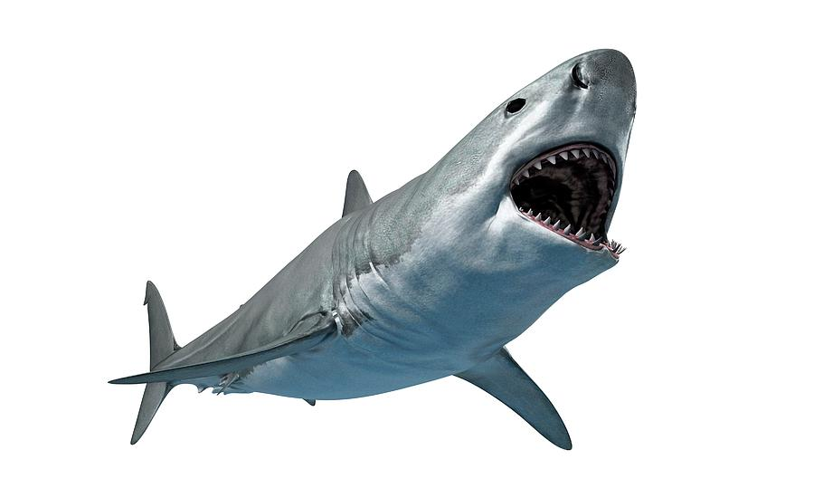
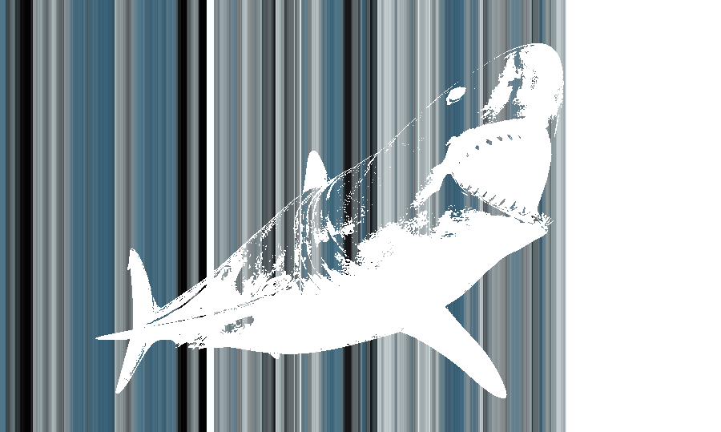

# ColorLines Image Generator

  
  

ColorLines is a simple image generator which uses color distributions from user provided image(s) to create an ouput featuring the image's silhouette against a Markov generated color background. The result is a print-like duplicate of the image.

ColorLines works best on images with a graphic style and prominent shadows and lines. The code can be run multiple times on the same image to produce different results. 
   
### How to Run
  1. Clone repo to local
  1. Run pip install -r requirements.txt
  1. Copy images to process in the inputs directory
  2. Run ./ImageGenerator.py
  3. Results are located in outputs directory

### Writeup [for Bowdoin College - CSCI 3275]

**Personal Meaning:** I wrote this program because I am a digital artist. I view my art (and the world) as a set of colors with a composition and contrast levels which makes the image more or less legible. This program was a unique way to re-imagine how effective my art was by remixing its color and contrast while technically keeping the exact same components of the original work. I particularly like how it can be used to quickly evaluate how effective the color palette and constrast levels of a piece are.   

**Challenges:** Previous programming projects only required me to program for results that were functional/passed a suite of tests. This project forced me to program for results that looked good, a deeper task that requires more subjective and exploratory thinking. As a result, the requirements were unstable and iterative (like in real life). Early in development I realized simply generating colors onto a pixel map would not look good. I ended up revising the code so the color generation would scale appropriately for larger images, and so the silhouette captured would invert based on whether there were more dark/light pixels in the image. 

Next steps for the projet:
- Improve the silhouette recognition of the image (especially for mostly light or mostly dark images)
- Create different background generations beyond vertical lines, such as checkers or abstract shapes
- Meaningfully combine the color matrices of multiple images into a single output
        
**Creativity:** This system is more derivative than creative. It requires a previously created image (either drawn by an artist, taken by a photographer, or generated by another system) to generate its color matrix and silhouette data. This is by design, as the goal of the program is to enhance artwork that has already been created by breaking down its components and re-displaying them. The program's role may loosely be classified as "exploratory creativity" in that it generates a novel item from an existing space of color and contrast distributions.  
    

### References

[HackerEarth](https://www.hackerearth.com/practice/notes/extracting-pixel-values-of-an-image-in-python/)

[Entechin](https://www.entechin.com/how-to-convert-an-image-to-black-and-white-in-python/)

[GeeksForGeeks](https://www.geeksforgeeks.org/how-to-manipulate-the-pixel-values-of-an-image-using-python/)

[StackOverflow](https://stackoverflow.com/questions/236692/how-do-i-convert-any-image-to-a-4-color-paletted-image-using-the-python-imaging-l)
